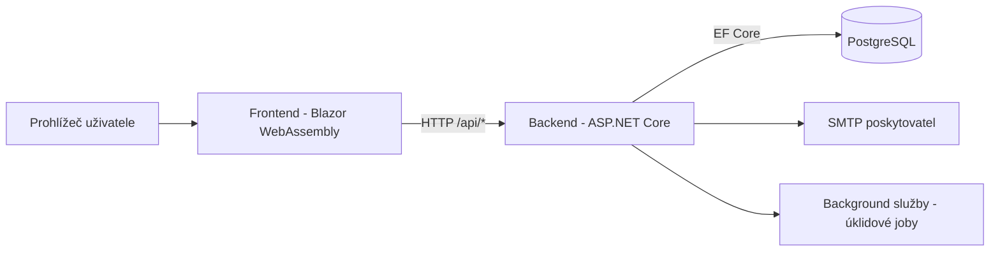

# Invenire

Full-stack aplikace pro správu a inventarizaci majetku, která umožňuje **generování a tisk QR kódů pro označení majetku**, **inventurní kontroly pomocí skenování**, **import majetku z externích systémů (JSON/XML)** a **sledování uživatelů a jejich přiděleného majetku**.  
Systém podporuje **evidenci chybějících kusů**, **reporty a statistiky**, **návrhy na vyřazení, opravu nebo úpravu údajů**, **archivaci předchozích kontrol** a **vyhodnocování rozdílů mezi inventurami**.

> ⚠️ **Důležité:** Tento repozitář obsahuje **frontend** (Blazor WebAssembly) aplikace Invenire. Backend je veden v samostatném repozitáři: [InvenireServer](https://github.com/realtobi999/InvenireServer).

## Obsah

- [Účel projektu](#účel-projektu)
- [Oficiální technická práce](#oficiální-technická-práce)
- [Přehled architektury](#přehled-architektury)
- [Použitý technologický stack](#použitý-technologický-stack)
- [Klíčové funkce](#klíčové-funkce)
- [Rychlý start](#rychlý-start)
- [Komunikace frontendu a backendu](#komunikace-frontendu-a-backendu)
- [Struktura složek](#struktura-složek)
- [Repozitář backendu a backend dokumentace](#repozitář-backendu-a-backend-dokumentace)
- [Jak přispět](#jak-přispět)
- [Licence](#licence)

## Účel projektu

Invenire je navrženo pro organizace, které potřebují jednotný a auditovatelný proces pro:

- správu organizace,
- onboarding zaměstnanců pomocí pozvánek,
- evidenci majetku a životního cyklu položek,
- inventurní skenování,
- řízené návrhy změn.

Aplikace je postavená na modelu rolí:

- **Admin** spravuje organizaci, zaměstnance, majetek, inventury a rozhodování o návrzích.
- **Employee** pracuje s přiřazenými položkami, aktivními inventurami a návrhy změn.

Záměr projektu a doménový model jsou podrobně popsány v oficiální technické práci.

## Oficiální technická práce

Oficiální technická práce k aplikaci je:

- `frontend/seminarka.md`

Najdete v ní:

- architektonická rozhodnutí,
- teoretické pozadí,
- chování funkcí,
- chronologii vývoje,
- bezpečnostní a testovací kontext.

## Přehled architektury

Invenire používá klient-server architekturu s odděleným frontendem a backendem.



### Odpovědnosti vrstev

| Vrstva | Odpovědnost |
|---|---|
| Frontend (`/frontend`) | UI, dashboardy podle rolí, formuláře, orchestraci API, klientské úložiště |
| Backend (`/backend`) | REST API, autentizace/autorizace, doménová logika, validace, persistence |
| Databáze | Trvalé ukládání uživatelů, organizací, majetku, inventur a návrhů |

## Použitý technologický stack

| Oblast | Technologie | Popis |
|---|---|---|
| Frontend runtime | .NET 9, Blazor WebAssembly | Klientská SPA aplikace běžící v prohlížeči pomocí Blazor WebAssembly. |
| Frontend storage | Blazored.LocalStorage | Ukládání uživatelských dat a nastavení do LocalStorage prohlížeče. |
| Frontend QR skener | BlazorBarcodeScanner.ZXing.JS, ZXingBlazor | Skenování QR a čárových kódů pomocí kamery přímo v prohlížeči. |
| API klient | HttpClient + vlastní CookieHandler | Komunikace s backend API včetně automatického předávání autentizačních cookies. |
| Backend runtime | .NET 9, ASP.NET Core Web API | Backend poskytující REST API pro frontend aplikaci. |
| Architektonický styl | CQRS + MediatR + FluentValidation | Oddělení aplikační logiky, zpracování požadavků a validace vstupních dat. |
| Persistence | EF Core + Npgsql (PostgreSQL) | Přístup k databázi přes ORM a PostgreSQL provider. |
| Databáze | PostgreSQL 15 | Relační databáze běžící v kontejneru pro ukládání aplikačních dat. |
| Logování | Serilog | Strukturované logování aplikace pro ladění a monitoring. |
| Infrastruktura | Docker + Docker Compose | Kontejnerizované prostředí pro frontend, backend a databázi. |

## Klíčové funkce

- autentizace a autorizace podle rolí (`Admin`, `Employee`)
- tvorba a správa organizace
- workflow pozvánek zaměstnanců (včetně importu)
- správa majetku a majetkových položek
- import/export položek (JSON a Excel)
- generování QR kódů pro identifikaci položek
- inventurní workflow (aktivní a dokončené inventury)
- workflow návrhů změn pro kontrolované úpravy
- dashboard přizpůsobený podle role uživatele

## Rychlý start

### Požadavky

- .NET SDK 9.0+
- Docker a Docker Compose
- přístup do obou repozitářů:
  - frontend (tento repozitář)
  - backend: [InvenireServer](https://github.com/realtobi999/InvenireServer)

### 🚀 Rychlý start (Docker)

Frontend a backend se spouští nezávisle, každý ve svém repozitáři.

1. Nastavte hodnoty konfigurace frontendu a backendu (viz `frontend/doc/config.md`).
2. Spusťte backend:

```bash
cd backend
docker compose -f docker-compose.dev.yml up --build
```

3. Spusťte frontend:

```bash
cd frontend
docker compose -f docker-compose.dev.yml up --build
```

4. Otevřete:

- Frontend: `http://127.0.0.1:5170`
- Backend API: `http://127.0.0.1:5071`

### 🛠️ Manuální start (bez Dockeru)

#### Frontend

```bash
cd frontend/src
dotnet run
```

Frontend čte základní URL API z:

- `frontend/src/wwwroot/appsettings.json`

#### Backend

Backend konfigurace v režimu development používá pro citlivé hodnoty **User Secrets**.

```bash
dotnet user-secrets init --project backend/src/InvenireServer.Presentation/InvenireServer.Presentation.csproj
ASPNETCORE_ENVIRONMENT=Development dotnet run --project backend/src/InvenireServer.Presentation/InvenireServer.Presentation.csproj --urls http://127.0.0.1:5071
```

Podrobné nastavení konfigurace viz `frontend/doc/config.md`.

## Komunikace frontendu a backendu

Frontend komunikuje s backendem přes REST endpointy pod `/api/*`.

### Request pipeline

1. Frontend nastaví `ApiConfiguration:BaseAddress` (v klientském appsettings).
2. `Program.cs` vytvoří scoped `HttpClient` s touto base address.
3. `CookieHandler` přidá browser credentials (`include`), pokud není explicitně nastaven `Authorization` header.
4. Backend přijímá JWT:
   - z cookie `JWT`, nebo
   - z `Authorization: Bearer <token>` headeru.

### Shrnutí autentizačního chování

- Login/register endpointy vrací JWT a nastavují jej jako HttpOnly cookie.
- Chráněné backend endpointy používají role/policy autorizaci.
- Povolené CORS originy jsou konfigurované na backendu (`CORS:AllowedOrigins`).

## Struktura složek

```text
frontend/
├─ readme.md
├─ seminarka.md
├─ doc/
│  └─ config.md
├─ scripts/
├─ docker-compose.dev.yml
├─ Dockerfile.dev
├─ Makefile
└─ src/
   ├─ Api/
   ├─ Common/
   ├─ Components/
   ├─ Configurations/
   ├─ Extensions/
   ├─ Layout/
   ├─ Pages/
   ├─ Properties/
   ├─ Program.cs
   ├─ Invenire.csproj
   └─ wwwroot/
```

## Repozitář backendu a backend dokumentace

- repozitář backendu: [InvenireServer](https://github.com/realtobi999/InvenireServer)
- backend README v tomto workspace: `backend/readme.md`
- reference pro backend konfiguraci ve frontend dokumentaci: `frontend/doc/config.md`

## Jak přispět

Příspěvky jsou vítané.

1. Forkněte repozitář.
2. Vytvořte feature branch.
3. Udržujte změny věcně vymezené a zdokumentované.
4. Lokálně spusťte aplikaci/testy pro dotčené části.
5. Otevřete pull request s:
   - popisem problému,
   - shrnutím implementace,
   - ověřovacími kroky.

<!-- TODO: doplnit issue templates, PR template a checklist code stylu -->

## Licence

- backend je licencovaný pod MIT (`backend/LICENSE`)
- deklarace licence pro frontend část v tomto repozitáři aktuálně chybí

<!-- TODO: přidat frontend LICENSE soubor a aktualizovat tuto sekci -->
