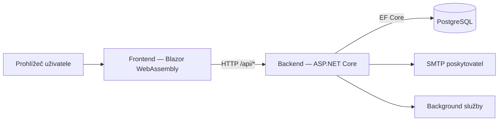

# Invenire

Invenire je full-stack aplikace pro **správu a inventarizaci majetku**. Umožňuje generování a tisk QR kódů, inventurní kontroly pomocí skenování, import majetku z externích systémů (JSON/XML) a sledování uživatelů s přiděleným majetkem. Systém dále podporuje evidenci chybějících kusů, reporty, návrhy na vyřazení či opravu a vyhodnocování rozdílů mezi inventurami.

> **Důležité:** Tento repozitář obsahuje pouze **frontend** (Blazor WebAssembly). Backend je veden samostatně v repozitáři [InvenireServer](https://github.com/realtobi999/InvenireServer).

## Obsah

- [Účel projektu](#účel-projektu)
- [Technická práce](#technická-práce)
- [Architektura](#architektura)
- [Technologický stack](#technologický-stack)
- [Klíčové funkce](#klíčové-funkce)
- [Rychlý start](#rychlý-start)
- [Komunikace frontendu a backendu](#komunikace-frontendu-a-backendu)
- [Struktura složek](#struktura-složek)
- [Backend](#backend)
- [Jak přispět](#jak-přispět)
- [Licence](#licence)

## Účel projektu

Invenire je určeno pro organizace, které potřebují jednotný a auditovatelný proces pro:

- Správu organizace
- Onboarding zaměstnanců pomocí pozvánek
- Evidenci majetku a životního cyklu položek
- Inventurní skenování
- Řízené návrhy změn

Aplikace pracuje s dvěma rolemi:

- **Admin** — spravuje organizaci, zaměstnance, majetek, inventury a rozhoduje o návrzích změn.
- **Employee** — pracuje s přiřazenými položkami, aktivními inventurami a podává návrhy změn.

## Technická práce

Podrobná technická dokumentace projektu se nachází v souboru `seminarka.md`. Obsahuje architektonická rozhodnutí, teoretické pozadí, popis chování funkcí, chronologii vývoje a bezpečnostní kontext.

## Architektura

Invenire využívá klient-server architekturu s důsledně odděleným frontendem a backendem.



### Odpovědnosti vrstev

| Vrstva   | Odpovědnost |
|----------|-------------|
| Frontend | UI, dashboardy podle rolí, formuláře, volání API, klientské úložiště |
| Backend  | REST API, autentizace a autorizace, doménová logika, validace, persistence |
| Databáze | Ukládání uživatelů, organizací, majetku, inventur a návrhů |

## Technologický stack

| Oblast | Technologie | Popis |
|--------|-------------|-------|
| Frontend runtime | .NET 9, Blazor WebAssembly | Klientská SPA aplikace běžící v prohlížeči. |
| Frontend storage | Blazored.LocalStorage | Ukládání uživatelských dat do LocalStorage. |
| QR skener | BlazorBarcodeScanner.ZXing.JS, ZXingBlazor | Skenování QR a čárových kódů přímo v prohlížeči. |
| API klient | HttpClient + vlastní CookieHandler | Komunikace s backendem včetně správy autentizačních cookies. |
| Backend runtime | .NET 9, ASP.NET Core Web API | REST API pro frontend aplikaci. |
| Architektonický styl | CQRS + MediatR + FluentValidation | Oddělení logiky, zpracování požadavků a validace vstupů. |
| Persistence | EF Core + Npgsql | Přístup k PostgreSQL přes ORM. |
| Databáze | PostgreSQL 15 | Relační databáze běžící v kontejneru. |
| Logování | Serilog | Strukturované logování pro ladění a monitoring. |
| Infrastruktura | Docker + Docker Compose | Kontejnerizované prostředí pro celý stack. |

## Klíčové funkce

- Autentizace a autorizace podle rolí (`Admin`, `Employee`)
- Tvorba a správa organizace
- Workflow pozvánek a importu zaměstnanců
- Správa majetku a majetkových položek
- Import a export položek (JSON, Excel)
- Generování QR kódů pro identifikaci položek
- Inventurní workflow (aktivní i dokončené inventury)
- Workflow návrhů změn pro kontrolované úpravy
- Dashboard přizpůsobený roli přihlášeného uživatele

## Rychlý start

### Požadavky

- .NET SDK 9.0+
- Docker a Docker Compose
- Přístup do obou repozitářů (frontend + [backend](https://github.com/realtobi999/InvenireServer))

### Spuštění přes Docker

Frontend a backend se spouštějí nezávisle, každý ve vlastním repozitáři.

1. Nastavte konfiguraci dle `doc/config.md`.
2. Spusťte backend:

```bash
docker compose -f docker-compose.dev.yml up --build
```

3. Spusťte frontend:

```bash
docker compose -f docker-compose.dev.yml up --build
```

4. Aplikace poběží na:
   - Frontend: `http://127.0.0.1:5170`
   - Backend API: `http://127.0.0.1:5071`

### Manuální spuštění (bez Dockeru)

1. Nastavte konfiguraci dle `doc/config.md`.
2. Spusťte frontend:

```bash
dotnet run
```

3. Backend v development režimu používá **User Secrets**. Inicializujte je příkazem:

```bash
dotnet user-secrets init --project src/InvenireServer.Presentation/InvenireServer.Presentation.csproj
```

4. Spusťte backend:

```bash
dotnet run --project src/InvenireServer.Presentation/InvenireServer.Presentation.csproj
```

## Komunikace frontendu a backendu

Frontend volá backend přes REST endpointy pod `/api/*`.

### Request pipeline

1. `ApiConfiguration:BaseAddress` nastaví cílovou adresu backendu.
2. `Program.cs` vytvoří scoped `HttpClient` s touto adresou.
3. `CookieHandler` automaticky přidá browser credentials, pokud není nastaven `Authorization` header.
4. Backend přijímá JWT token:
   - z HttpOnly cookie `JWT`, nebo
   - z hlavičky `Authorization: Bearer <token>`

### Autentizační chování

- Endpointy pro přihlášení a registraci vrací JWT a nastavují jej jako HttpOnly cookie.
- Chráněné endpointy vyžadují příslušnou roli nebo policy.
- Povolené CORS originy se konfigurují na backendu (`CORS:AllowedOrigins`).

## Struktura složek

```text
frontend/
├── readme.md
├── seminarka.md
├── doc/
│   └── config.md
├── scripts/
├── docker-compose.dev.yml
├── Dockerfile.dev
├── Makefile
└── src/
    ├── Api/
    ├── Common/
    ├── Components/
    ├── Configurations/
    ├── Extensions/
    ├── Layout/
    ├── Pages/
    ├── Properties/
    ├── Program.cs
    ├── Invenire.csproj
    └── wwwroot/
```

## Backend

- Repozitář: [InvenireServer](https://github.com/realtobi999/InvenireServer)
- Dokumentace backendu: `readme.md` v repozitáři backendu.
- Konfigurační reference: `doc/config.md` v tomto repozitáři.

## Jak přispět

Příspěvky jsou vítány. Oceníme věcně zaměřené návrhy, které respektují stávající styl kódu a obsahují ověření dotčené funkcionality.

1. Forkněte repozitář.
2. Vytvořte feature branch.
3. Udržujte změny věcně ohraničené a zdokumentované.
4. Lokálně ověřte funkčnost dotčených částí.
5. Otevřete pull request s:
   - popisem problému,
   - shrnutím implementace,
   - ověřovacími kroky.

## Licence

- Backend je licencován pod [MIT](https://github.com/realtobi999/InvenireServer/blob/main/LICENSE).
- Frontend aktuálně nemá samostatnou licenci — bude doplněna.
